<picture>
  <source media="(prefers-color-scheme: dark)" srcset="./assets/pipeline-dark.svg">
  
</picture>

# Hi, I'm Abasifreke Nkanang 👋

**Data Platform Engineer** building data platforms and the infrastructure they run on.

I'm interested in making life easier by ensuring the availability of data and enhancing its use for informed decision-making. Most of my work sits where data engineering meets platform engineering: pipelines, the cloud infrastructure underneath them, and the automation that ships both.

- 🔭 Currently building at @kovolabs and @Cue-Sessions
- 🔬 Research interests: big data, AI/ML, security, blockchain
- 📍 Based in Nigeria

  
  
  
  
  
  

## Featured work

| Project | What it is | Stack |
|---|---|---|
| [chess-puzzle-generator](https://github.com/Data-Bishop/chess-puzzle-generator) | Serverless ETL platform that ingests Chess.com game archives, runs batch Stockfish analysis on AWS Lambda, and serves personalised tactical puzzles through a web UI. Deployed end to end with IaC and CI/CD. | Python, AWS Lambda, FastAPI, PostgreSQL, Redis, Terraform, GitHub Actions |
| [BuildItAll Data Platform](https://github.com/Data-Bishop/Team5-BuildItAll-Data-Platform) | Cost-optimised big data processing platform on AWS for an e-commerce case study, built in a team of four. | PySpark, EMR, Airflow, Terraform, GitHub Actions |
| [pr-deploy](https://github.com/hngprojects/pr-deploy) | GitHub Action that deploys every pull request into its own Docker container, so changes can be tested in isolation before merging. Core contributor. | Shell, Docker, GitHub Actions |
| [Mail server setup guide](https://github.com/Data-Bishop/Linux-Postfix-Dovecot-Bind9-Setup-Guide) | Guide and configuration for a self-hosted Linux mail server, from DNS to delivery. | Postfix, Dovecot, Bind9 |
| [ETL-csv-to-db-demo](https://github.com/Data-Bishop/ETL-csv-to-db-demo) | Small containerised ETL pipeline for learning the basics: extract from CSV, transform, load into a database. | Python, Docker, PostgreSQL |

## Toolbox

| | |
|---|---|
| **Languages** |     |
| **Processing & messaging** |     |
| **Orchestration & transformation** |    |
| **Warehouses & lakehouse** |     |
| **Databases** |      |
| **Cloud** |    |
| **Infrastructure & containers** |     |
| **CI/CD & GitOps** |     |
| **Observability** |     |
| **APIs & backend** |     |
| **Analytics & BI** |   |
